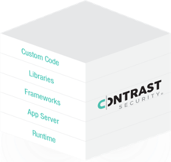

+++
title = "Main Page"
chapter = true
description = "The Contrast Security Workshop"
weight = 1
layout = "slidelist"
outputs = ["Reveal"]

[logo]
src = "images/contrast.png"
alt = "Contrast Security"
[reveal_hugo.templates.note]
background = "#32a852"
transition = "zoom"

[reveal_hugo.templates.info]
background = "#0011dd"
transition = "convex"

[reveal_hugo.templates.tip]
background = "#faa332"
transition = "zoom"

[reveal_hugo.templates.warning]
background = "#fa220a"
transition = "zoom"

+++
# Contrast Security Workshop

This site is a collection of workshop modules covering Application Security with Contrast Security.  Over time, we'll add modules to address individual topics.  Some examples include an overall introduction to Contrast Security, or how to instrument a Container running a Java application.

-The Contrast Security Team

- [Navigation help](#navigation-help)
- [Module List](#module-list)

---
## Welcome

Welcome to the Contrast Security Workshop for new users.  In this workshop, you will learn how Contrast Security gives you unprecedented insight into the security of your applications.

We'll guide you through different use cases that utilize Contrast Security for your Application Security.  These use cases include working through the first-time instrumentation of your applications, or building a multi-stage DevOps pipeline with built-in security.

As we guide you through the modules, we'll expose additional vulnerabilities and see the results in Contrast Security as they happen with well-known OWASP examples.

---
## Objectives
{}
Module 1 – Introduction to Contrast Security
Module 2 – Instrumenting a Container
Module 3 – Instrumenting a Java application
Module 4 – Adding Contrast Security to a Jenkins Pipeline
Module 5 - Using the Contrast API
{}

This workshop contains several modules covering different use cases.  The objectives for each module will be explained by your instructor and the presentation materials.

---

## Time and Prerequisites
The time needed for this introduction is about 15 minutes.

Your instructor will provide details about the infrastructure allocated to you, or what you may need for each module.

---
# About Contrast Security

Contrast Security is an automated security testing solution that infuses software with vulnerability assessment capabilities so that security flaws are automatically identified. Contrast Security utilizes dynamic binary instrumentation to identify vulnerabilities in web applications and APIs. Organizations can use Contrast Assess to secure their applications without changing the application software stack or how they build, test, or deploy code. The result is accurate, continuous vulnerability assessment that integrates seamlessly with existing software development and security processes, scales across the software development lifecycle and the entire application portfolio, and easily outpaces traditional solutions.

---
## Workshop flow

We'll utilize well-known, public-domain applications in our experiments.  One example application, Webgoat, is developed in conjunction with the Open Web Application Security Project (OWASP) Foundation.  The OWASP Foundation is a community dedicated to improving software security.

Each module may introduce other public-domain applications.   

[OWASP Foundation](https://owasp.org/)

[WegGoat Git Repository](https://github.com/Contrast-Security-OSS/WebGoat_BBP_FORK)

---

## Navigation Help

The general flow is from top-to-bottom in vertical sections, and left-to-right for the next section.

- Use your arrow keys to navigate left, right, up, down.
- Use the ESC or "o" key to see a map of the presentation.
- Use the "s" key to see the Speaker Notes for the page.
- Use your browser back/forward controls to cycle through your history.

---
## Key Concepts - Interactive Application Security Testing
{}
Emphasis is on the instrumentation as an inside-out view of your software application.
{}

Interactive Application Security Testing, or IAST, is a modern approach to software security that is favorable to DevOps teams.  In earlier software security models, teams had to run security operations in separate and time-consuming processes not connected to your DevOps pipeline.  IAST, on the other hand, is fast and is well-integrated into your DevOps pipeline with immediate feedback.

---
## Contrast Assess - IAST

Contrast Assess neither scans nor attacks applications but, instead, uses patented, state-of-the-art, deep security instrumentation technology to combine the most effective elements of static and dynamic testing, software composition and configuration analysis technologies, delivering them directly into applications. As you can see on the following picture, Contrast instruments not just the custom code but other elements of the application as well providing far better coverage as compared with other application security solutions.

As we discussed, Contrast Security is unique in the way how it identifies vulnerabilities. Now let's take a look at some of the benefits of this approach.

---
## Highest Accuracy

Instrumentation allows Contrast Security to report the vulnerabilities from the inside of applications which produces highly accurate results without dependence on security experts. In addition, Contrast Security combines the most effective elements of Interactive (IAST), Static (SAST), and Dynamic (DAST) application security testing technology, software composition analysis (SCA), and configuration analysis, delivering them directly into applications. This combination of techniques produces the telemetry necessary to detect vulnerabilities with virtually no false positives and no false negatives.

---
## Scalable Architecture

Contrast Assess scales because it instruments application security into each application, delivering and distributing vulnerability assessment across an entire application portfolio. Every running application continuously produces results in parallel. Contrast differs from legacy approaches that require application security experts – a human element that does not scale. Even with hundreds or thousands of applications, Contrast Assess provides an always up-to-date dashboard for each application with vulnerability, library, architecture, and other security details.

---
## Contrast is ideal for DevSecOps

Unlike legacy approaches that require time-consuming, late-stage scans that disrupt the development process, there is no separate security testing phase with Contrast Assess. Contrast Assess uses its deep security instrumentation to produce a continuous stream of accurate vulnerability analysis whenever and wherever software is run. Development, QA, DevOps, and security teams get results as they develop and test software, enabling them to find and fix security flaws early in the software lifecycle when they are easiest and cheapest to remediate.

Contrast Security enables DevOps teams to deliver security-as-code by:

- Empowering developers to embed security as early as possible in the cycle
- Providing continuous vulnerability assessment throughout SDLC (see the following picture)
- Automating security into the pipeline
- Monitoring attacks the way you monitor performance


[See the full-sized picture](home/contrast2.png)

---
## How Contrast is Different from DAST

Traditional DAST tools try to exploit the running application with attacks, and detect vulnerabilities by analyzing HTTP responses. DAST, on the other hand, is blind to what occurs within the application and provides only limited coverage of an application. Contrast Assess performs a complete static analysis of all the code, as described above, and analyzes HTTP traffic and responses from inside the application. Because Contrast Assess works from within the application, it also provides more accurate analysis than traditional Penetration (Pen) Testing tools. Also, unlike either SAST or DAST products, Contrast Assess uses techniques found in Software Composition Analysis (SCA) tools to build an inventory of all the libraries, frameworks, and microservices used by the application to identify vulnerabilities across all those components.

---
## How Contrast is Different from SAST

Traditional SAST solutions attempt to build a model of an application and pseudo-execute it from known entry points – but SAST is blind to how all the pieces of an application work together and operate at runtime and can generate extensive false negatives and false positives. Contrast Assess observes real data and control flow activity from within a running application and identifies a much broader range of vulnerabilities – with greater accuracy – than traditional SAST solutions. Contrast Assess is fully distributed and infuses each application with a “self-assessment” capability that performs analysis continuously, in parallel, across an entire portfolio of applications. SAST solutions cannot operate in a distributed manner because they rely on experts to analyze and triage results, which creates a significant bottleneck.

---
## Key Concepts - Runtime Application Self-Protection

Runtime Application Self-Protection, or RASP, is protection added to applications in production environments.  RASP is a best practice solution to stop hackers’ attempts to compromise enterprise applications and data. A RASP solution incorporates security into the running application wherever it resides on a server, providing better threat visibility from inside of the running application. Being server-based, RASP security is able to detect, block, and mitigate attacks immediately, protecting applications as they run in real time by analyzing both application behavior and context.

---

# Setup and Prerequisites

This workshop has a few prerequisites and infrastructure requirements.

When Contrast Security is hosting the workshop, most requirements will be setup for you.  You may skip these instructions as directed by your instructor.

---
## Your workshop workstation
{}
Instructors: This workshop is designed for student-users to access Contrast Security quickly without needing to configure infrastructure and tooling.  We wish to focus on Contrast Security and less on configuring third-party dependencies (Git, Kubernetes, Eclipse, maven/gradle, etc.)  Some modules will be designed for self-service, but the initial set is for a guided experience.
{}

In Contrast-guided workshops, your instructor will provide you with a cloud-based Windows workstation configured with tools and scripts.  Your instructor will provide a Remote Desktop file (RDP) for your logon, plus credentials.

You should assume you will be running all operations from that workstation, as it is equipped with a common set of infrastructure to best ensure the workshop operations.

---
## Your IDE - Eclipse
{}
Module 4 will use Eclipse.
{}

In this workshop, you will be using Eclipse.  Eclipse is already installed on your workstation.

---
## Contrast TeamServer
TeamServer is where you send data and information about your running applications and servers.  

In this workshop, we'll use the Contrast Security Evaluation Saas offering at this location:
https://eval.contrastsecurity.com

There are two parts to your credentials:

- Traditional username + password to access the site via the URL listed above.
- As a convenience, we're providing the Java agent configuration file named, `contrast_security.yaml.`

The screens may vary from what we show, as Contrast Security provides regular updates to the SaaS offering.

---
## Contrast Teamserver - Community Edition
Self-directed workshops use the Community Edition of TeamServer.  Your Contrast Security team will tell you when to use this in lieu of the Eval server.

---

# Module List

You can jump to different modules from here.
- Module 1: [First Time Contrast Users](m01-fist-time-users)
- Module 2: [Instrumenting a Container](m02-instrumenting-container)
- Module 3: [Instrumenting a Java application](m03-instrumenting-java-app)
- Module 4: [Building a DevOps Pipeline with Contrast](m04-cd-pipeline)
- Module 5: [Using the Contrast API](m05-teamserver-api)
- Module 6: [Introduction to Open Source](m06-intro-to-oss)
